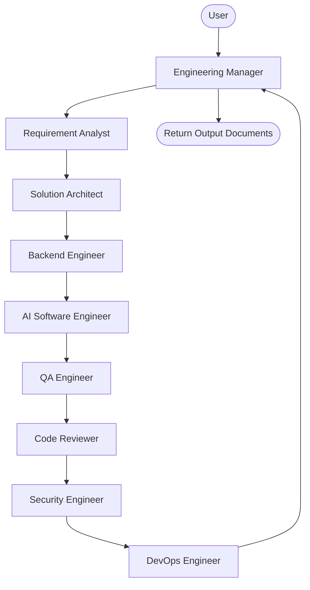

# ForgeAI

ForgeAI is a multi-agent AI Software Engineering Team built using the Eve framework. Instead of relying on a single AI agent, ForgeAI simulates a real software engineering organization where specialized AI agents collaborate to transform business requirements into production-ready software. By delegating responsibilities to dedicated roles, the system achieves higher precision, handles complex codebases robustly, and structures outputs according to industry best practices.

---

## Why ForgeAI?

### Problems with Single AI Agents
Single AI agents often struggle when tasked with end-to-end software development. They suffer from context drift, lose track of specifications, mix architectural design with implementation logic, and are prone to hallucinations when the scope of work increases.

### Advantages of Specialized AI Agents
Dividing the software development lifecycle into distinct phases allows each agent to focus on a single domain. Specialized agents work with smaller, targeted prompts and distinct contexts, resulting in higher-quality output and fewer errors.

### Multi-Agent Collaboration
ForgeAI coordinates agents sequentially. Each agent receives structured input from the previous stage, processes it, and generates a refined artifact. This mimics a real engineering department, establishing a clear chain of custody for requirements, designs, code, and deployment scripts.

### Real Software Engineering Workflow
By mirroring real engineering workflows, the project ensures that business requests are not implemented blindly. They are analyzed, designed, planned, coded, reviewed, and configured for deployment by individual specialists before any code is delivered.

---

## Features

* **Multi-Agent Architecture**: Built with multiple collaborative subagents specializing in requirements analysis, architecture, database schemas, API specs, coding, QA testing, code review, security review, and DevOps.
* **Engineering Manager Orchestration**: Features a central orchestrator that guides the sequential execution of tasks and passes deliverables between agents.
* **Requirement Analysis**: Generates comprehensive functional and non-functional requirements documents, highlighting assumptions, risks, and engineering tasks.
* **Solution Architecture**: Designs high-level software architectures, technology stacks, schemas, REST APIs, and external integrations.
* **Backend Blueprint Generation**: Defines folder structures, domain models, controller routes, validation rules, and error handling strategies.
* **AI Software Engineering**: Converts backend blueprints into clean, modular, and production-ready code blocks adhering to SOLID and DRY principles.
* **QA Testing Planning**: Designs comprehensive unit, integration, API, and performance testing strategies, and outputs detailed QA test reports.
* **Code Review**: Automatically reviews generated source code against quality standards, architecture compliance, bugs, performance bottlenecks, and security.
* **Security Analysis**: Conducts application and API security reviews, threat modeling, secrets configuration checking, OWASP auditing, and cloud security review.
* **DevOps Planning**: Designs containerization configurations, CI/CD pipelines, environment setups, and cloud infrastructure layout.
* **Modular Agent Design**: Subagents are declared under individual directories, keeping instructions, configs, and scopes completely decoupled.
* **Human-in-the-loop Approvals**: Fully integrates two distinct approval checkpoints (Architecture Review and Engineering Review) using Eve's built-in `ask_question` tool to pause execution and route revision requests.
* **Extensible Architecture**: Easy to introduce new specialists by adding agent subfolders with custom declarations and prompts.

---

## Architecture



---

## Agent Responsibilities

| Agent | Responsibility |
| --- | --- |
| Engineering Manager | Coordinates the software development process by orchestrating task delegation and compilation across specialized subagents. |
| Requirement Analyst | Analyzes the user's business request to generate a structured requirements document defining functional, non-functional, and scope parameters. |
| Solution Architect | Designs the high-level system architecture, database schema, API contracts, and technology stack based on approved requirements. |
| Backend Engineer | Converts architectural plans into structured backend blueprints detailing folder layouts, domain models, controllers, and services. |
| AI Software Engineer | Implements production-ready, clean, and modular backend source code that adheres strictly to the backend blueprint. |
| QA Engineer | Designs comprehensive software testing strategies (unit, integration, API, performance, end-to-end) and produces QA reports based on code. |
| Code Reviewer | Performs a comprehensive code review to identify bugs, security issues, performance bottlenecks, and architectural compliance. |
| Security Engineer | Reviews the architecture, implementation, and deployment blueprint from a security perspective to produce a security assessment report. |
| DevOps Engineer | Designs the production deployment blueprint, including containerization configs, CI/CD pipelines, cloud resources, and monitoring setups. |

---

## Workflow

ForgeAI uses a sequential workflow orchestrated by the Engineering Manager with Human-in-the-loop (HITL) approval checkpoints:

1. **User Input**: The user submits a software feature request to the Engineering Manager.
2. **Requirements Ingestion**: The Engineering Manager forwards the request to the Requirement Analyst. The analyst produces a structured requirements document.
3. **Architecture Mapping**: The requirements document is passed to the Solution Architect, who translates it into a high-level system design.
4. **🧑 Human Approval Gate #1 (Architecture Review)**: The Engineering Manager pauses execution, transitions the state to `Awaiting Architecture Approval`, and presents a structured review summary to the user using the built-in `ask_question` tool.
   - **Approve**: Continues automatically to the Backend Engineer.
   - **Request Changes**: Ask for feedback, route it back to the Solution Architect for revisions, and re-presents the review screen.
   - **Reject**: Terminates the workflow.
5. **Backend Blueprinting**: The approved architecture design is passed to the Backend Engineer, who maps out codebase structure, routing, and data models.
6. **Implementation**: The AI Software Engineer converts the blueprint into modular, production-ready source code files.
7. **Quality Assurance Strategy**: The generated code is sent to the QA Engineer, who designs a multi-layered testing plan and produces a QA report.
8. **Code Quality Review**: The generated code is reviewed by the Code Reviewer to produce a detailed defect, compliance, and refactoring report.
9. **Security Assessment**: The system design, source code, and configurations are sent to the Security Engineer, who conducts threat modeling and OWASP audits to produce a security assessment report.
10. **🧑 Human Approval Gate #2 (Engineering Review)**: The Engineering Manager pauses execution, transitions to `Awaiting Deployment Approval`, and presents an Engineering Review screen summarizing QA, Security, and Code Quality status.
    - **Approve**: Continues automatically to the DevOps Engineer.
    - **Request Changes**: The user selects which artifact needs revision (Backend Blueprint, Source Code, QA, Security, Code Review), types feedback, which is routed only to the responsible specialist. Once revised, the system re-presents the review screen.
    - **Reject**: Terminates the workflow.
11. **Deployment Design**: The DevOps Engineer constructs Docker configs, CI/CD scripts, and cloud topologies based on the approved codebase.
12. **Aggregation**: The Engineering Manager compiles and presents all final deliverables to the user.

---

## Artifact Management

ForgeAI maintains a structured artifact repository throughout the engineering workflow under the `artifacts/` directory in the sandbox filesystem. 

### Folder Structure
- `artifacts/requirements/` - Requirements Specification documents (`requirements_v<N>.md`)
- `artifacts/architecture/` - Architecture Specification documents (`architecture_v<N>.md`)
- `artifacts/backend/` - Backend blueprints (`backend_blueprint_v<N>.md`)
- `artifacts/implementation/` - Generated production-ready source code (`implementation_v<N>.md`)
- `artifacts/qa/` - QA reports and test scenarios (`qa_report_v<N>.md`)
- `artifacts/security/` - Security assessment reports (`security_report_v<N>.md`)
- `artifacts/review/` - Code reviewer reports (`review_report_v<N>.md`)
- `artifacts/deployment/` - DevOps blueprints (`deployment_blueprint_v<N>.md`)

### Versioning & Traceability
- **Incremental Versioning**: Artifacts are never overwritten or deleted. Any revision requested during approval gates increments the version suffix (e.g. `_v1.md` -> `_v2.md`).
- **Traceability References**: Every artifact contains a YAML metadata header detailing the Title, Version, Author (responsible subagent), Timestamp, Status (`Draft` or `Approved`), and the Parent Artifact file(s) from which it was generated (e.g. `architecture_v2.md` lists `requirements_v3.md` as its parent).

---

## Example

To demonstrate the workflow, consider the following business request:

"Build a cloud-based POS system with one central warehouse, seventeen stores, inventory management, barcode scanning, role-based authentication, purchase orders, and stock transfers."

The system processes the request as follows:

* **Requirement Analyst**: Evaluates store scaling (seventeen stores plus central warehouse), barcode hardware integration parameters, inventory thresholds, and purchase order states to compile the requirements.
* **Solution Architect**: Designs a multi-tenant relational schema for warehouses and stores, specifies the technology stack (e.g. PostgreSQL, Node.js), creates REST API schemas for stock transfer routes, and drafts the high-level architecture.
* **Backend Engineer**: Formulates the folder layout, designs database model entities (Warehouse, Store, InventoryItem, StockTransfer), routes controller endpoints, and outlines the JWT auth middleware.
* **AI Software Engineer**: Generates the TypeScript code for WarehouseController, StockTransferService, and AuthenticationMiddleware.
* **QA Engineer**: Designs API integration tests, outlines inventory edge-cases (negative stock states), and creates load test specs for seventeen concurrent stores.
* **Code Reviewer**: Reviews the generated TypeScript files to verify password hashing strength, check for potential N+1 queries in stock transfer queries, and list refactoring tasks.
* **Security Engineer**: Performs threat modeling on store-to-warehouse communications, reviews secrets encryption protocols, and audits OWASP Top 10 risks in input parameters.
* **DevOps Engineer**: Creates a multi-container Docker Compose file, sets up GitHub Actions to run tests, and recommends a cloud deployment layout using AWS RDS and ECS.

---

## Project Structure

```text
agent/
├── agent.ts                   # Orchestrator agent configuration
├── instructions.md            # Orchestrator identity and workflow prompts
├── channels/
│   └── eve.ts                 # Eve messaging channel setup
└── subagents/
    ├── requirement_analyst/   # Requirement Analyst subagent folder
    │   ├── agent.ts
    │   └── instructions.md
    ├── solution_architect/    # Solution Architect subagent folder
    │   ├── agent.ts
    │   └── instructions.md
    ├── backend_engineer/      # Backend Engineer subagent folder
    │   ├── agent.ts
    │   └── instructions.md
    ├── ai_software_engineer/  # AI Software Engineer subagent folder
    │   ├── agent.ts
    │   └── instructions.md
    ├── qa_engineer/           # QA Engineer subagent folder
    │   ├── agent.ts
    │   └── instructions.md
    ├── code_reviewer/         # Code Reviewer subagent folder
    │   ├── agent.ts
    │   └── instructions.md
    ├── security_engineer/     # Security Engineer subagent folder
    │   ├── agent.ts
    │   └── instructions.md
    └── devops_engineer/       # DevOps Engineer subagent folder
        ├── agent.ts
        └── instructions.md
```

---

## Tech Stack

* **Eve Framework**: A filesystem-first, durable agent framework that runs the model loops, manages agent state, and exposes HTTP endpoints.
* **TypeScript**: Core language used for agent configuration, channel endpoints, and scripting.
* **Node.js**: The underlying runtime for the Eve server.
* **Anthropic Claude**: The large language model (specifically Claude 3.5 Sonnet) powering the reasoning and outputs of all agents.
* **Vercel AI Gateway**: Proxy layer managing model requests, rate-limiting, and credentials.

---

## Design Principles

* **Separation of Concerns**: Each step in the development process has a dedicated agent, ensuring prompts and output contexts remain clean and focused.
* **Single Responsibility Principle**: Agents have clear constraints and boundaries. For example, the Solution Architect designs the schema but never writes implementation code.
* **Human-in-the-loop**: The pipeline is built to support verification checkpoints where humans can review and edit intermediate deliverables.
* **Modular Design**: Subagents are decoupled and self-contained within their respective folders.
* **Extensibility**: Adding new specialized capabilities requires writing a standard subagent directory with no changes to the core Eve runtime.
* **Production-first Thinking**: Designs emphasize real-world architectures, secure secrets management, clean coding patterns, and operational readiness.

---

## Future Roadmap

* **Frontend Engineer Agent**: Introduce a specialist subagent to design and implement client-side user interfaces.
* **Database Engineer Agent**: Introduce a specialist to optimize query performance, design migrations, and configure replica setups.
* **Product Manager Agent**: Implement an agent to draft product roadmaps, prioritize backlog issues, and verify feature scope.
* **MCP Integration**: Connect specialized agents to Model Context Protocol (MCP) servers for enhanced local environment interactions.
* **Long-term Memory**: Introduce agent memory across sessions to recall custom developer styles and architectural preferences.
* **Parallel Agent Execution**: Optimize execution speeds by running non-dependent steps (e.g., Code Reviewer and DevOps Engineer) concurrently.
* **GitHub Integration**: Automatically open Pull Requests, submit review comments, and update issue tickets.
* **Slack Integration**: Connect the Engineering Manager to Slack to allow users to trigger software development pipelines directly from chat.
* **Automatic Pull Requests**: Support end-to-end PR generation from feature branches.

---

## Contributing

We welcome contributions to add new specialized agents or improve existing ones. To add a new subagent:

1. Create a subfolder under `agent/subagents/<agent_name>/`.
2. Author `agent.ts` using `defineAgent` and provide a required `description` field.
3. Author `instructions.md` containing the agent's identity, responsibilities, boundaries, and expected deliverables.
4. Update the root Engineering Manager's `agent/instructions.md` available agents list and workflow description to integrate the new subagent.
5. Run `npm run build` to verify discovery.

---

## License

This project is licensed under the MIT License - see the LICENSE file for details.

---

## Closing

ForgeAI serves as a blueprint for multi-agent collaboration in software engineering. By structuring AI interactions around established software development lifecycle roles and using the Eve framework, it demonstrates how specialized AI agents can collaborate to build production-ready software through structured engineering workflows.
